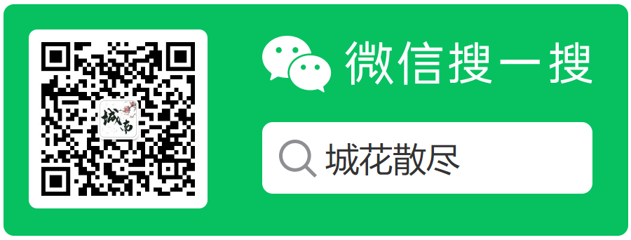

<h1 align="center">QQChatGPT🤖</h1>
<p>
  
  <a href="#" target="_blank">
    
  </a>
</p>

> 用 NoneBot + Go-cqhttp + 其他Robot（ChatGPT, 腾讯小微）等实现一个群里@回复机器人；

# NOTICE

> 2022-12-26: ChatGPT 又不支持了，将持续关注最新进度。官方/非官方 API 开启后第一时间接入。

## Install

按照 [install](./install.md) 教程学习一下 go-cqhttp安装；

然后安装 NoneBot(nb) 后，在虚拟环境中
  
```shell 
git clone git@github.com:hbchen121/QQChatGPT.git
```

配置好自己的QQ号（在gp-cqhttp里），需要的QQ群等信息（在插件里config里），然后在当前文件夹下直接运行就行

```shell 
nb run
```

## Others

- 友情提示，先用小号，小心被干掉！

其他好玩的东西：

- [WebChat 网页聊天机器人](https://github.com/hbchen121/WebChat)
- [QQChatGPT 聊天机器人](https://github.com/hbchen121/QQChatGPT)
- [WXSA_ROBOT 微信公众平台机器人](https://github.com/hbchen121/wxsa_robot)


#### 欢迎莅临我的个人主页：[城南小屋](https://hbchen121.github.io/) 

### 欢迎大家关注我的公众号：

